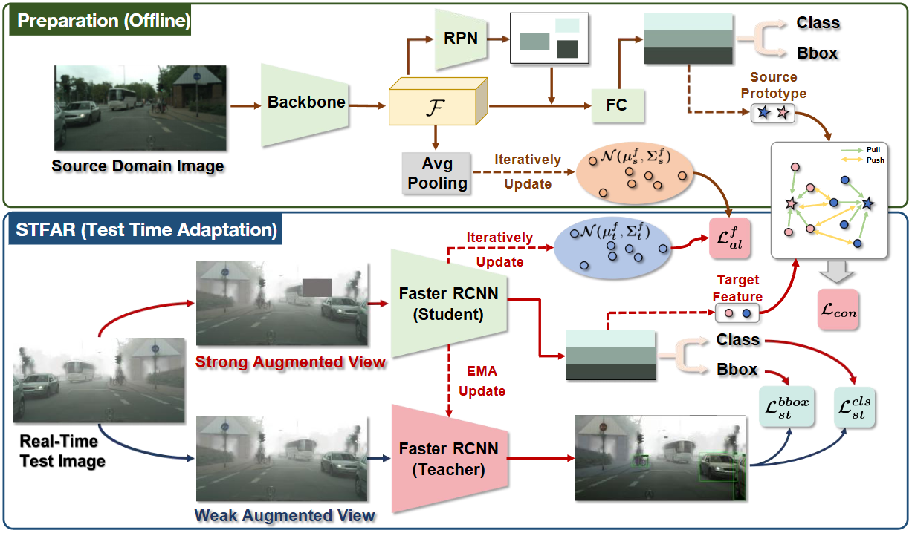

# STFAR: Improving Object Detection Robustness at Test-Time by Self-Training with Feature Alignment Regularization



This repository provides the official implementation of the paper  
["STFAR: Improving Object Detection Robustness at Test-Time by Self-Training with Feature Alignment Regularization"](https://arxiv.org/abs/2303.17937).

---

## 🚀 Usage

### 📦 Requirements

First, set up the environment as follows:

```bash
conda create -n stfar python=3.8
conda activate stfar

pip install torch==1.9.0+cu111 torchvision==0.10.0+cu111 torchaudio==0.9.0 -f https://download.pytorch.org/whl/torch_stable.html
pip install mmcv-full==1.3.9 -f https://download.openmmlab.com/mmcv/dist/cu111/torch1.9/index.html

cd thirdparty/mmdetection/
pip install -v -e .

cd ../..
pip install -r requirements.txt
pip install -v -e .

pip install -U scikit-learn
pip install ipdb
pip install yapf==0.29.0
```

## 📁Preparation

### 📁Data Preparation

We conducted experiments using following domain adaptation settings:

- **Image corruption: COCO -> COCO_C, PASCAL -> PASCAL_C,** COCO_C and PASCAL_C datasets were generated using the package available at [imagecorruptions](https://github.com/bethgelab/imagecorruptions). This package is used to generate images corresponding to fifteen different types of corruptions, with a severity level of 5.
  - [COCO_C Download Link](https://drive.google.com/drive/folders/1Ei4RTyhqqjKdJvZA-Nkaet-5UEJn6O8B?usp=drive_link)
  - [PASCAL_C Download Link](https://drive.google.com/file/d/1-wqPX9Fni-4B-2QRmZ8xsyK-elbb5c1f/view?usp=drive_link)

- **Synthetic Weather: Cityscapes → Foggy-Cityscapes**  
  The Foggy-Cityscapes dataset is a synthetic domain derived from Cityscapes by simulating foggy weather conditions. It is commonly used for studying domain adaptation in adverse weather scenarios.  
  - [Foggy-Cityscapes Download Link](https://www.cityscapes-dataset.com/downloads/)

- **Style Shift: Pascal VOC → Clipart**  
  The Clipart dataset contains cartoon-style images and is used to evaluate model generalization from realistic to artistic domains. It is part of the DomainNet benchmark.  
  - [Clipart Dataset Download Link](http://ai.bu.edu/M3SDA/)

### 💾 Source Model Weight Preparation

- For the source domain model checkpoints used for different datasets, please find the download links below: [Model Weight Link](https://drive.google.com/drive/folders/19g7bTCkCHNfUi9AkyQ0TKCW4t5R0lVKL?usp=sharing). After downloading, place the files into the `pretrain` directory.

### 📊Source Model Statistics Preparation

- We employ the same approach as [TTAC](https://github.com/Gorilla-Lab-SCUT/TTAC) to iteratively update the running statistics of global features and foreground features in the source domain, obtaining the source domain statistical features. 

  You can download the required source domain statistical features from the Google Drive link below : [Statistical Features Link](https://drive.google.com/drive/folders/1gieeMf7Jkv735ti81fzbm43qIKaW4TON?usp=drive_link). After downloading, place the files into the `feat_statistics` directory.

## 🏋️‍♀️ Training

To train STFAR under the corruption domain adaptation setting (e.g., Pascal → Pascal_C), run the following command:

```shell
bash scripts/train_voc_stfar.sh
```

## 🙏 Acknowledgements

This work is built upon several open-source projects, including:

- [MMDetection](https://github.com/open-mmlab/mmdetection)
- [TTAC](https://github.com/Gorilla-Lab-SCUT/TTAC)
- [Image Corruptions](https://github.com/bethgelab/imagecorruptions)
- [Soft Teacher](https://github.com/microsoft/SoftTeacher)
- [FSCE](https://github.com/megvii-research/FSCE)

We sincerely thank the developers and contributors of these projects for their valuable work.

## 📚 Citation
If you find this work helpful, please consider citing:
```bib
@article{chen2023stfar,
  title={STFAR: Improving Object Detection Robustness at Test-Time by Self-Training with Feature Alignment Regularization},
  author={Chen, Yijin and Xu, Xun and Su, Yongyi and Jia, Kui},
  journal={arXiv preprint arXiv:2303.17937},
  year={2023}
}
```
